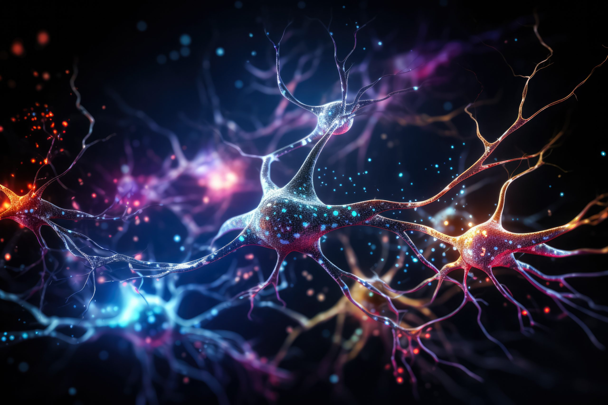

# Deep-Learning-Project
In this project, two strategies for image classification are applied and compared using the CIFAR100 dataset from Keras (https://keras.io/api/datasets/cifar100/).

### **Strategy 1: Pre-trained Network**
The first strategy involves the use of pre-trained networks on the ImageNet dataset, which perform transfer learning and fine tuning to classify CIFAR100 objects. Three types of architectures (MobileNetV2, Xception, and DenseNet121) are compared and the one that provides the best metrics is selected. Once selected, extensive experimentation is performed using various optimization techniques to improve the performance of the neural network (weight regularization, dropout, batch normalization, data augmentation, etc.).

### **Strategy 2: Training from Scratch**
The second strategy is to design, train, and optimize a neural network from scratch. In this case, decisions regarding the selection of features, layers, and hyperparameters are empirically justified. Extensive experimentation with various optimization techniques (weight regularization, dropout, batch normalization, data augmentation, etc.) is also performed.

